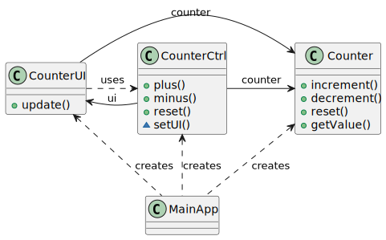
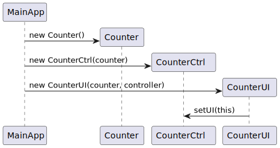
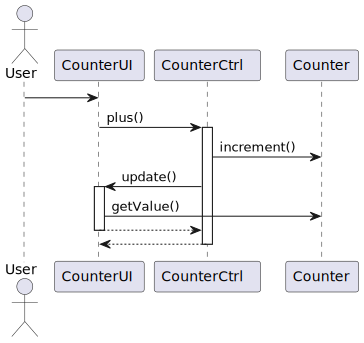

# Counter GUI Application

An very simple GUI application used to show key concepts in sw design.

## Design



Startup sequence



UI event handling sequence



## Build and Run

The application can be build using the standard Maven command

```bash
mvn package
```

This creates a file `counter-1.0.0.jar` in the `target` folder that can be run

```bash
java -jar target/counter-1.0.0.jar 
```

---

Updated on February 26, 2026